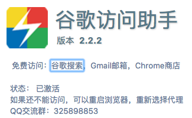
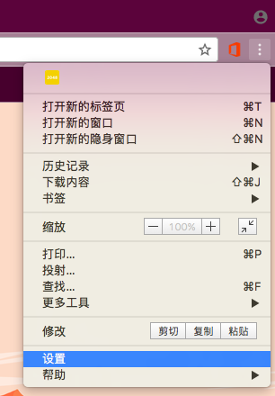
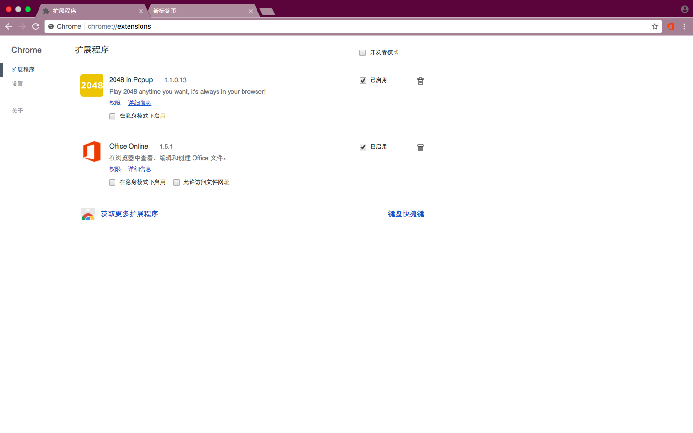
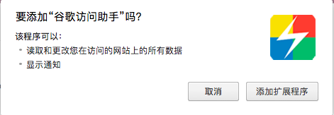
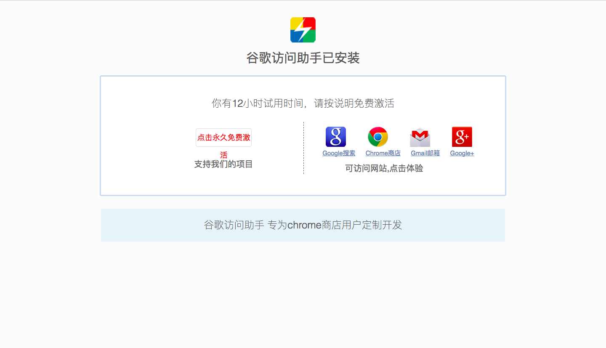

“虽然Google在中国大陆被禁，但通过这款浏览器插件，我们仍能访问谷歌搜索、Chrome商店、Gmail等其他Google旗下的产品。”

下面是这款浏览器插件的使用方法（用Chrome演示）：
Step 1：
下载Google访问助手（文末有获取方式）
Step 2：
点击Chrome右上角的

点击设置

点击扩展程序

打开系统的文件管理器，找到并点开文件夹“谷歌访问助手chrome版”

将

拖入

这时，Chrome上方会出现

点击“添加扩展程序”
如果成功，会出现这个网页

Step 3：
将 http://360.hao245.com (360导航) 或者 http://123.hao245.com (hao123导航) 设为首页 然后重启浏览器即可永久激活
设置方法请点击网页中的“点击永久免费激活”按钮
